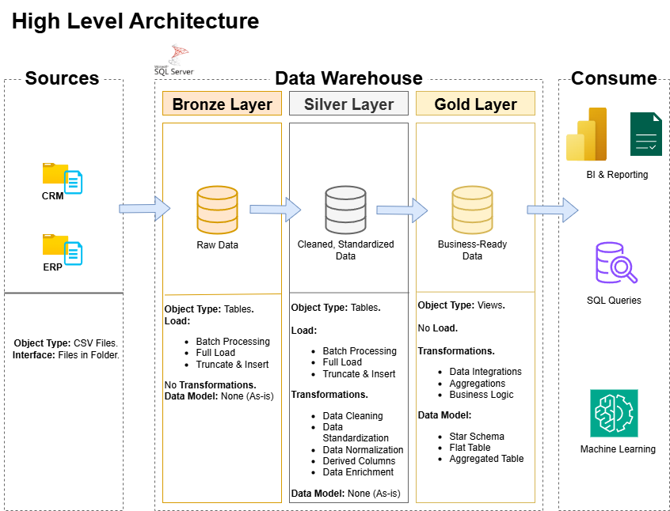

# Data Warehouse and Analytics Project
Welcome to the **Data Warehouse and Analytics Project** repository! 
This porject demonstrates a comprehensive data warehousing and analytics solution, from building a data warehouse to generating actionable insights. Designed as a portfolio project that highlights industry best practices in data engineering and analytics.

---

# Data Architecture

The data architecture for this project follows the **Medallion Architecture** (Bronze, Silver, Gold layers):

## High-Level Architecture

1. **Bronze Layer**:  Stores raw data as-is from the source systems. Data is ingested from CSV Files into SQL Server Database.  

2. **Silver Layer**: This layer includes data cleansing, standardization, and normalization processes to prepare data for analysis.  

3. **Gold Layer**: Gold Layer: Houses business-ready data modeled into a star schema required for reporting and analytics.  

---

# 📚 Project Overview

This project involves:
1. **Data Architecture**: Designing a Modern Data Warehouse Using Medallion Architecture Bronze, Silver, and Gold layers.
2. **ETL Pipelines**: Extracting, transforming, and loading data from source systems into the warehouse.
3. **Data Modeling**: Developing fact and dimension tables optimized for analytical queries.
4. **Analytics & Reporting**: Creating SQL-based reports and dashboards for actionable insights.

✨ This repository is an excellent resource for professionals and students looking to showcase expertise in:
- SQL Development
- Data Architect
- Data Engineering
- ETL Pipeline Developer
- Data Modeling
- Data Analytics

---

## 🛠️ Important Links & Tools:

**Everything is for Free!**

- **[Datasets](datasets/)**: Access to the project dataset (csv files).
- **[SQL Server Express](https://www.microsoft.com/en-us/sql-server/sql-server-downloads)**: Lightweight server for hosting your SQL database.
- **[SQL Server Management Studio (SSMS)](https://learn.microsoft.com/en-us/ssms/install/install?view=sql-server-ver16)**: GUI for managing and interacting with databases.
- **[Git Repository](https://github.com/)**: Set up a GitHub account and repository to manage, version, and collaborate on your code efficiently.
- **[DrawIO](https://www.drawio.com/)**: Design data architecture, models, flows, and diagrams.

---

## Project Requirements

### Building the Data Warehouse (Data Engineering)

#### Objective
Develop a modern data warehouse using SQL Server to consolidate sales data, enabling analytical reporting and informed decision-making.

#### Specifications
- **Data Sources**: Import data from 2 source systems (ERP and CRM) provided as CSV files.
- **Data Quality**: Cleanse and resolve data quality issues prior to analysis.
- **Integration**: Combine both sources into a single, user-friendly data model designed for analytical queries.
- **Scope**: Focus on the latest dataset only; historization of data is not required.
- **Documentation**: Provide clear documentation of the data model to support both business stakeholders and analytics teams.

---

### BI: Analytics & Reporting (Data Analytics)

#### Objective
Develop SQL-based analytics to deliver detailed insights into:
- **Customer Behavior**
- **Product Performance**
- **Sales Trends**

These insights empower stakeholders with key business metrics, enabling strategic decision-making.

---

## 🛡️ License
This project is licensed under the [MIT License](https://opensource.org/licenses/MIT ). You are free to use, modify, and share this project with proper attribution.

---

## ☀️ About Me
Hi there!   I am Ali Assuleiteen. I am an IT professional, and I love working with data.

Let's stay in touch! Feel free to connect with me on the following platforms:

